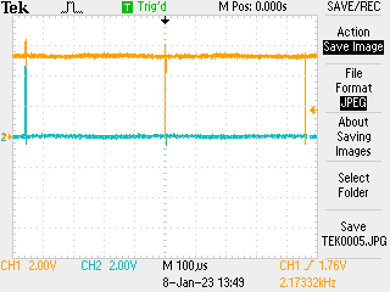

# The Boiler Monitor Project
## Background

I have an [EKO 40 wood gasification boiler](http://www.newhorizonstore.com/Products/88-eko-gasification-boiler.aspx) in my basement to heat the house.  It is a great machine, but it is a chore to restart if the fire goes out, so I try to make sure it does not run out of fuel.  Since my office is on the second floor, I end up checking on the boiler more often than is really necessary to make sure it doesn’t go out.

## First Solution Attempt

 
Boiler Controller with four 7-segment display digits.

The boiler has a controller with a temperature readout on top, so I started thinking about ways that I could transmit the temperature to my office.  My first attempt was to point an old smartphone at the temperature readout and use the [Alfred Camera](https://alfred.camera/) app to capture the camera output which I could view on my phone.  This approach worked fairly well, except that the old Android phone would freeze up regularly.

## Second Attempt

I decided to try a different approach and see if I could read a signal off the controller’s circuit board.  Here I found that I was in luck: The circuit board has a 6-pin connection which was used to program the microcontroller when the controller was manufactured.  This microcontroller (micro) chip is essentially the “brain” of the controller.  After the micro was programmed, these same conductors were used to send the signal to the four 7-segment display digits, so I could easily tap into that signal with the existing connector!  Since I was not willing to solder or modify the circuit board, tapping into this signal on the connector was critical.

 
The 6-pin connector.

Since I already had a Raspberry Pi on hand from a previous project, I decided to use it to read the signal that the microcontroller was sending to the 7-segment display.  The Raspberry Pi is a tiny computer that can be used to build just about any electronic project imaginable.  In this case, I would wire the signal from the controller’s connector into the Raspberry Pi so that the Pi could read the signal and send it to me in some way.

 
Raspberry Pi 4B.

Right away, I ran into trouble.  When I examined the signal coming from the controller it looked like it was sending about 2000 blips a second.

 
 
The signal ‘blips’

When I zoomed in on the ‘blips’, I found that they actually contained the data that was going to the display digits: 8 zeros or ones that would turn on or off the 7 LED segments (plus the period) in each digit. But the data was being sent out at such a high speed, the Raspberry Pi would have no chance of catching it.

  
 
Zoomed-in data from the microcontroller: data in yellow and clock in blue.

Since the Pi would not be able to read the data fast enough, I would need to add some pre-processing circuitry that would capture the data, and then relay it to the Pi in a format that the Pi could accept.  Fortunately, adding circuitry to a Pi is a very common task, so there are boards made specifically for cases like this, such as the [Perma-Proto HAT](https://www.adafruit.com/product/2310).  Pi HATs (Hardware Attached on Top) allow add-on boards to be attached to the Pi’s standard connector.  This particular HAT allowed me to add a couple silicon chips and wire the signals coming from the controller and going to the Pi.

  
 
The Raspberry Pi with the preprocessing circuitry.

My preprocessing circuit required two chips: a [SN74HC164N](https://www.ti.com/lit/ds/scls115g/scls115g.pdf) and a [CD74HCT4024E](https://rocelec.widen.net/view/pdf/xvc0d41swi/cd74hct4024.pdf?t.download=true&u=5oefqw).  The first chip would capture the high speed 0s and 1s coming from the controller and turn into 8 separate signals that the Pi could read at a much slower rate.  The second chip would have the job of keeping track of which digit is currently being sent.  The microcontroller sends out all four digits on the same wire.  It transmits digit 1, takes a break, digit 2, takes a break, etc.  Since the clock signal sends a pulse for each bit transmitted, this second chip counts the clock pulses, and tells the Pi each time 8 bits have been sent, allowing the Pi to read the information for each digit in sequence.
 
 
 
Preprocessing circuit diagram.

## The Pi software.

Since I’ve been using TypeScript Node.js in my daily work, I decided to use the same for this project.  The Pi software was fairly straightforward: capture the data from the controller and store it in a cloud database where an app could access it.

The aforementioned counter chip sends two bits to the Pi for the four different states 00 for the first digit, 01 for the second, 10 for the third, and 11 for the fourth.  The low bit changes every time the digit changes, so the Pi reads the digit every time the low bit changes.  Then, using a lookup table, the Pi converts the bits to a digit.  The controller uses digits 0-9 as well as a few alpha characters to display text like “FUEL”.

Once the data has been parsed, the Pi sends information to a Firestore database.  It also watches for error and “fuel out” conditions and sends push notifications in these cases.

### Software challenges

Occasionally, the signal from the micro would glitch.  Of course, since the hardware is updating the display 500 times a second, these would never be seen by the eye.  However, they would be caught by the Pi software so it was necessary to add an averaging function to eliminate these glitches.

Another challenge was knowing which digit was which.  When the counter chip powers up, the next digit transmitted by the micro may be first digit, but it may be any other digit.  The hardware would have a signal from the micro to the digits that would select which digit is currently being addressed, but this signal was not on the 6-pin connector.

Luckily, since the digits only displayed in certain fixed formats (like 180F shown in Fig 1) it was possible to ascertain from the data which digit was digit 1.  So, if there were three numbers followed by an F, the first number was the first digit.

## The Flutter app
The last ingredient to complete this project is an app to display the data from the boiler.  I built the app with Flutter so that I could use it on both my desktop and phone.  Firebase has great Flutter support, so it was straightforward to read the data and update the app accordingly.  It gives realtime temperature as well as showing the temperature log with any errors (such as fuel running out in the attached figure).
 
 
 
The Flutter app.

I had a lot of fun building this project.
